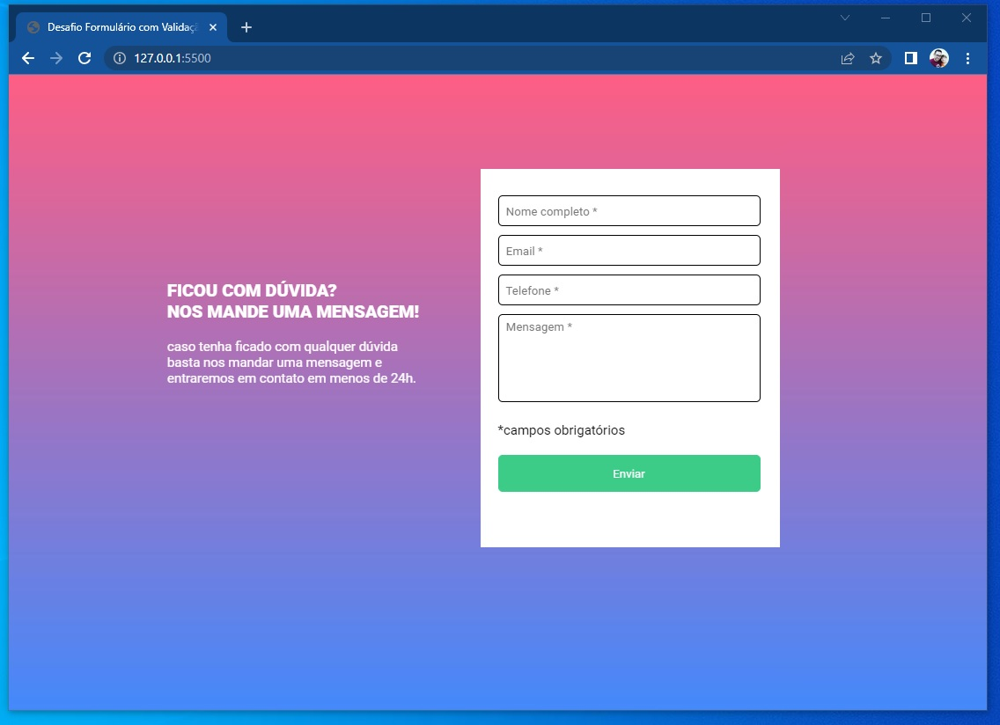
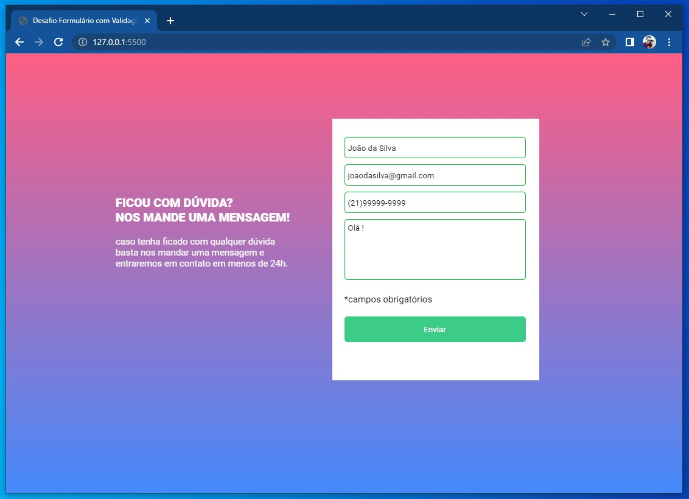
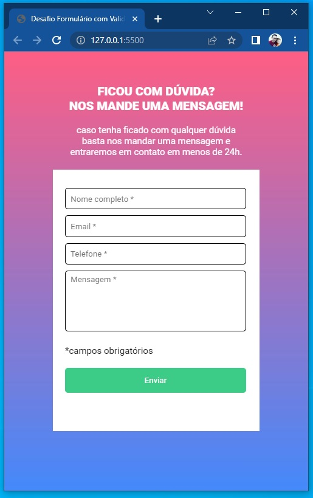
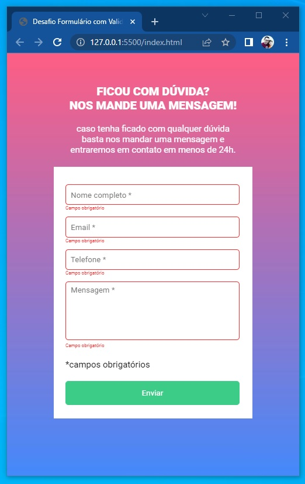
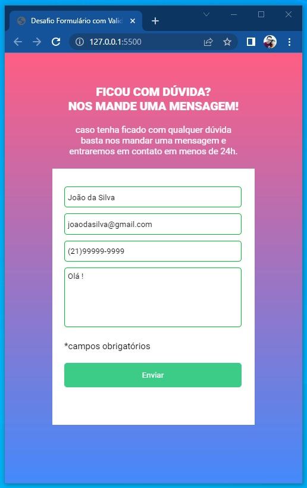

<h1 align="center">
 Formulário com Validação - Desafio JS Intermediário
</h1>

<b>Desktop Preview</b> 🖥️ 💻

 
  

 
  

 
  

<b>Mobile Design</b> 📲

  

  

  

  

  <a href="#-tecnologias">Tecnologias</a>&nbsp;&nbsp;&nbsp;|&nbsp;&nbsp;&nbsp;
  <a href="https://prof-danielcorrea.github.io/devquest-desafio-formulario-com-validacao-js/">Projeto</a>&nbsp;&nbsp;&nbsp;|&nbsp;&nbsp;&nbsp;

 

## 🚀 Tecnologias e 📚 Conhecimentos colocados em prática:

Esse projeto foi desenvolvido obedecendo as orientações informadas [Figma](https://www.figma.com/file/zBKnYG9UNdUiIr8ClQTWSG/?node-id=3%3A2
), objetivando a referencia do aprendizado. Foi utilizado as seguintes linguagens:

- HTML5
- CSS3
- JS INTERMEDIÁRIO

## 🚧 Projeto:

 

Link do Projeto: [Desafio JS Intermediário](https://prof-danielcorrea.github.io/devquest-desafio-formulario-com-validacao-js/)

---

Feito por Daniel Correa
